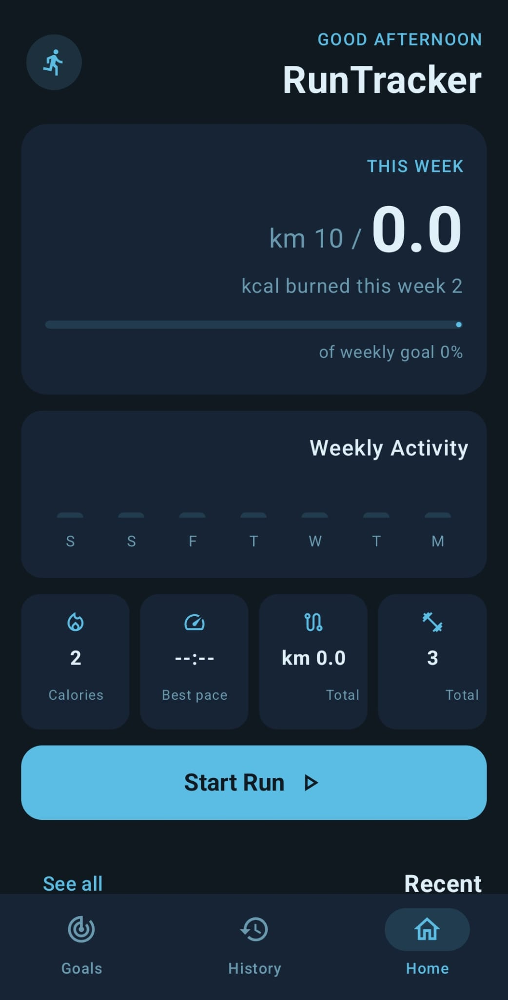
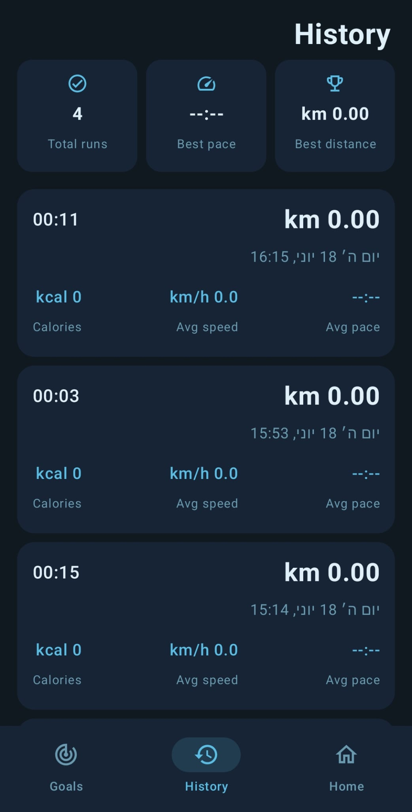
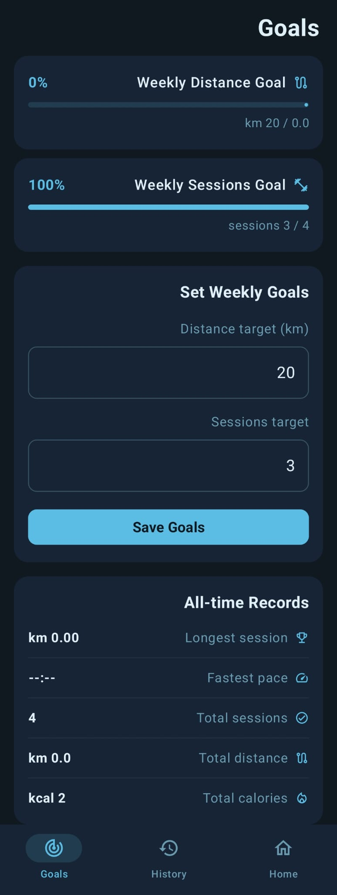
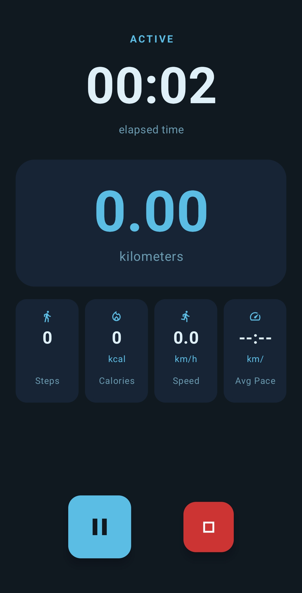
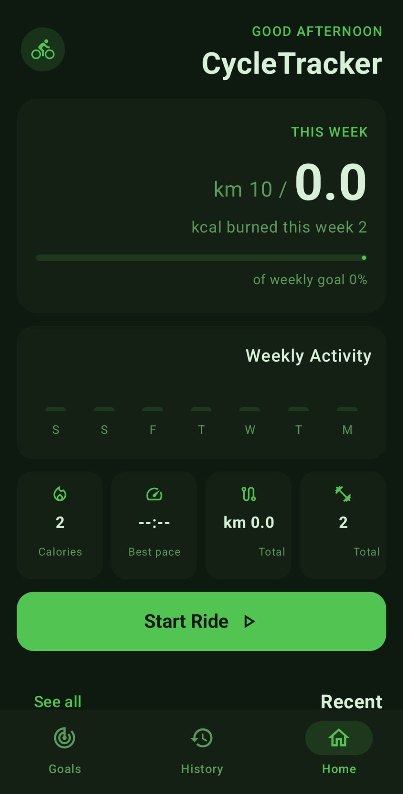
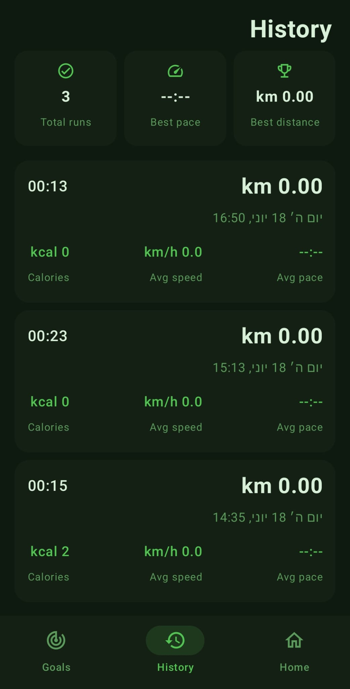

# FitnessTracker

A multi-module Android fitness tracking application built with Jetpack Compose. The project contains two separate apps — **RunTracker** and **CycleTracker** — that share a common module containing all shared logic, UI, and data layer.

---

## Project Structure

```
FitnessTracker/
├── common/          # Shared Android Library
├── running/         # RunTracker app
├── cycling/         # CycleTracker app
```

---

## :common Module

The heart of the project. An Android Library that contains everything shared between the two apps. Neither app duplicates any logic — they simply extend `BaseActivity` and provide a configuration object.

### What's inside

#### Data Layer (`data/`)
| File | Description |
|------|-------------|
| `WorkoutSession.kt` | Room entity representing a saved workout session with distance, duration, pace, calories, steps, and personal best flags |
| `WeeklyGoal.kt` | Room entity storing the user's weekly distance and session targets |
| `WorkoutDao.kt` | DAO with queries for sessions, weekly summaries, personal bests, and goals |
| `FitnessDatabase.kt` | Room database definition with migration support |
| `SessionRepository.kt` | Repository layer — saves sessions, detects personal bests, loads history and stats |
| `SportTypeConverter.kt` | Room type converter for the `SportType` enum |

#### Engine Layer (`engine/`)
| File | Description |
|------|-------------|
| `AppConfig.kt` | Data class that each app provides — sport type, colors, MET value, labels |
| `WorkoutState.kt` | Live state during an active workout (time, distance, pace, speed, calories, steps) |
| `WorkoutEngine.kt` | Core engine — manages GPS via `FusedLocationProviderClient`, step detection via `SensorManager`, live timer via coroutines, calorie calculation, and coaching milestone alerts |
| `FitnessViewModel.kt` | Shared ViewModel connecting the engine, repository, and UI. Handles navigation, personal best notifications, and all reactive data flows |

#### UI Layer (`ui/`)
| File | Description |
|------|-------------|
| `FitnessTheme.kt` | Material3 theme built from the app's `AppConfig` colors |
| `MainScaffold.kt` | Root composable with `Scaffold` and bottom navigation bar |
| `HomeScreen.kt` | Dashboard — dynamic greeting, weekly goal card, activity bar chart, all-time stats, recent sessions, and Start button |
| `ActiveWorkoutScreen.kt` | Live workout screen — elapsed time, distance, pace, speed, calories, step counter (running only), coaching alerts, pause/resume/stop controls |
| `HistoryScreen.kt` | Full session history with personal best highlighting |
| `GoalsScreen.kt` | Weekly goal setting and all-time records |

#### Base
| File | Description |
|------|-------------|
| `BaseActivity.kt` | Abstract activity. Calls `buildConfig()`, sets up the ViewModel, requests runtime permissions (location, activity recognition, notifications), and renders `MainScaffold` |

---

## :running — RunTracker

A running tracker app. Extends `BaseActivity` and provides a running-specific configuration.

**What it provides:**
- Sport type: `RUNNING`
- Blue color theme (`#5BBCE4`)
- MET value: `9.8` (higher calorie burn rate for running)
- Coaching milestone every **1 km**
- Step counter enabled (uses device step detector sensor)

**MainActivity** — the entire app-specific code:
```kotlin
override fun buildConfig() = AppConfig(
    sportType  = SportType.RUNNING,
    appName    = "RunTracker",
    metValue   = 9.8,
    accentColor = Color(0xFF5BBCE4),
    ...
)
```

**Permissions declared:**
- `ACCESS_FINE_LOCATION`
- `ACCESS_COARSE_LOCATION`
- `ACTIVITY_RECOGNITION`
- `POST_NOTIFICATIONS`

---

## 📸 Screenshots

| Home | History | Goals |
|---|---|---|
|  |  |  |

| Timer |
|---|
|  |

---

## :cycling — CycleTracker

A cycling tracker app. Extends `BaseActivity` and provides a cycling-specific configuration.

**What it provides:**
- Sport type: `CYCLING`
- Green color theme (`#52C452`)
- MET value: `7.5` (lower calorie burn rate for cycling)
- Coaching milestone every **1 km**
- No step counter (cyclists don't take steps)

**MainActivity** — the entire app-specific code:
```kotlin
override fun buildConfig() = AppConfig(
    sportType  = SportType.CYCLING,
    appName    = "CycleTracker",
    metValue   = 7.5,
    accentColor = Color(0xFF52C452),
    ...
)
```

**Permissions declared:**
- `ACCESS_FINE_LOCATION`
- `ACCESS_COARSE_LOCATION`
- `ACTIVITY_RECOGNITION`
- `POST_NOTIFICATIONS`

---

## 📸 Screenshots

| Home | History | Goals |
|---|---|---|
|  |  |  |

| Timer |
|---|
|  |

## Features

- **Real-time GPS tracking** — distance, current speed, average pace using `FusedLocationProviderClient` with high accuracy mode
- **Live timer** — counts up in real time with pause and resume support
- **Step counter** — hardware step detector sensor (RunTracker only)
- **Calorie estimation** — MET × weight × time, only calculated when the user is actually moving
- **Coaching alerts** — text banner every 1 km with current average pace
- **Session history** — all workouts saved in a Room database, persisted across app launches
- **Personal bests** — automatically detected on save, highlighted in history with a trophy badge, and sent as a push notification
- **Weekly goals** — set a weekly distance and session target, track progress with a live progress bar
- **Weekly activity chart** — bar chart showing activity per day of the week
- **Dynamic greeting** — Good morning / Good afternoon / Good evening / Good night based on current time

---

## Tech Stack

| | |
|---|---|
| Language | Kotlin |
| UI | Jetpack Compose + Material3 |
| Architecture | MVVM (ViewModel + StateFlow) |
| Database | Room |
| Location | FusedLocationProviderClient (Google Play Services) |
| Step counting | SensorManager — TYPE_STEP_DETECTOR |
| Async | Kotlin Coroutines |
| Build | Gradle with Kotlin DSL + Version Catalog |

---

## Requirements

- Android 9.0 (API 28) or higher
- Android Studio with AGP 8.9.2
- Device with GPS and step detector sensor

---

## Credits

Project by:

Yahav Eliyahu
